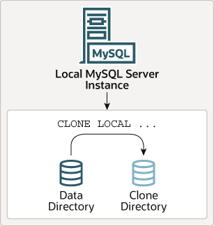
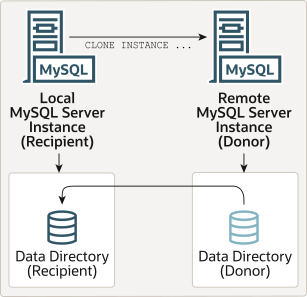

### 7.6.7  Clone 插件

- [7.6.7.1 安装 Clone 插件](./07.06.07.01.安装 Clone 插件.md)
- [7.6.7.2 本地克隆数据](./07.06.07.02.本地克隆数据.md)
- [7.6.7.3 远程克隆数据](./07.06.07.03.远程克隆数据.md)
- [7.6.7.4 克隆与并发DDL](./07.06.07.04.克隆与并发DDL.md)
- [7.6.7.5 克隆加密数据](./07.06.07.05.克隆加密数据.md)
- [7.6.7.6 克隆压缩数据](./07.06.07.06.克隆压缩数据.md)
- [7.6.7.7 用于复制的克隆](./07.06.07.07.用于复制的克隆.md)
- [7.6.7.8 克隆操作期间创建的目录和文件](./07.06.07.08.克隆操作期间创建的目录和文件.md)
- [7.6.7.9 远程克隆操作失败处理](./07.06.07.09.远程克隆操作失败处理.md)
- [7.6.7.10 监控克隆操作](./07.06.07.10.监控克隆操作.md)
- [7.6.7.11 停止克隆操作](./07.06.07.11.停止克隆操作.md)
- [7.6.7.12 克隆系统变量参考](./07.06.07.12.克隆系统变量参考.md)
- [7.6.7.13 克隆系统变量](./07.06.07.13.克隆系统变量.md)
- [7.6.7.14  Clone 插件限制](./07.06.07.14. Clone 插件限制.md)

 Clone 插件在MySQL 8.0.17中引入，允许本地或从远程MySQL服务器实例克隆数据。克隆的数据是存储在InnoDB中的数据的物理快照，包括架构、表、表空间和数据字典元数据。克隆的数据包括一个完全功能的数据目录，允许使用 Clone 插件进行MySQL服务器的配置。

图5.1 本地克隆操作

CLONE LOCAL语句将本地MySQL服务器实例的数据目录克隆到另一个本地目录，这个目录被称为克隆目录。

本地克隆操作将数据从启动克隆操作的MySQL服务器实例克隆到同一服务器或节点上的目录。

图5.2 远程克隆操作

从本地接收者MySQL服务器实例发出的CLONE INSTANCE语句将远程供体MySQL服务器实例的数据目录克隆到本地接收者MySQL服务器实例的数据目录。

远程克隆操作涉及一个本地MySQL服务器实例（“接收者”），在此启动克隆操作，以及一个远程MySQL服务器实例（“供体”），源数据位于此处。当在接收者上启动远程克隆操作时，克隆的数据会通过网络从供体传输到接收者。默认情况下，远程克隆操作会在从供体克隆数据之前从接收者数据目录中删除现有的用户创建的数据（架构、表、表空间）和二进制日志。可选地，您可以将数据克隆到接收者的不同目录，以避免从当前接收者数据目录中删除数据。

与远程克隆操作相比，本地克隆操作克隆的数据没有差别。两种操作克隆相同的数据集。

 Clone 插件支持复制。除了克隆数据外，克隆操作还从供体提取并传输复制坐标，并将它们应用在接收者上，这使得使用 Clone 插件配置组复制成员和副本变得更快更有效（见第5.6.7.7节，“用于复制的克隆”）。组复制成员还可以配置为使用 Clone 插件作为恢复的替代方法，以便成员自动选择从种子成员检索组数据的最有效方式。更多信息，请参见第18.5.4.2节，“克隆用于分布式恢复”。

 Clone 插件支持克隆加密和页面压缩数据。请参见第5.6.7.5节，“克隆加密数据”，和第5.6.7.6节，“克隆压缩数据”。

必须安装 Clone 插件才能使用它。有关安装说明，请参见第5.6.7.1节，“安装 Clone 插件”。有关克隆说明，请参见第5.6.7.2节，“本地克隆数据”，和第5.6.7.3节，“远程克隆数据”。

提供了性能模式表和监控克隆操作的工具。请参见第5.6.7.10节，“监控克隆操作”。