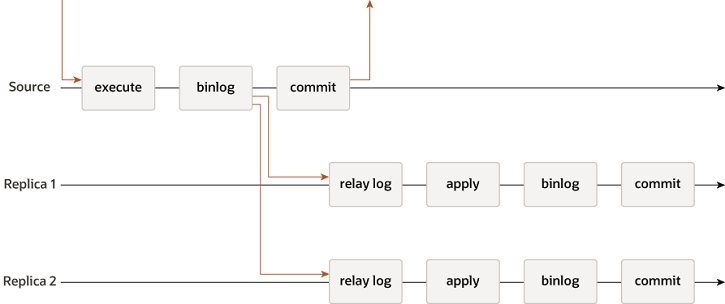
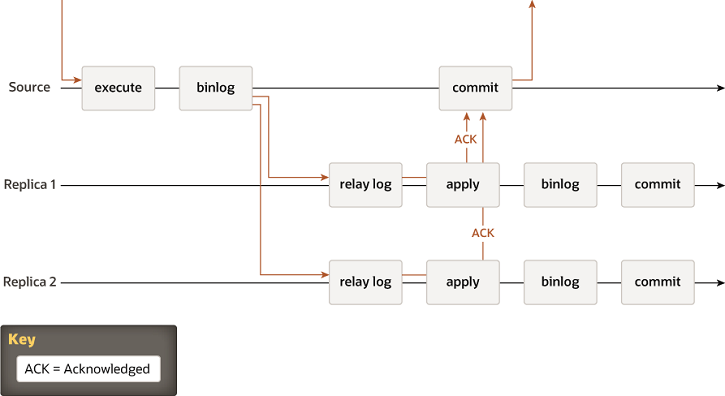

#### 18.1.1.1 主从复制

传统的MySQL复制提供了一种简单的主到副本的复制方法。源（主服务器）是主要的，有一个或多个副本（从服务器），它们是次要的。源应用事务，提交它们，然后这些事务稍后（即异步地）被发送到副本上，要么被重新执行（在基于语句的复制中）或应用（在基于行的复制中）。它是一个共享无关系统，所有服务器默认都有一份完整的数据副本。

**图 18.1 MySQL 异步复制**

源接收到的事务被执行，写入二进制日志，然后提交，然后向客户端应用程序发送响应。二进制日志的记录在源提交之前被发送到副本1和副本2的中继日志。在每个副本上，事务被应用，写入副本的二进制日志，并提交。源上的提交和副本上的提交都是独立的和异步的。

还有半同步复制，它在协议中增加了一个同步步骤。这意味着主服务器在应用时等待从服务器确认已收到事务。只有在从服务器确认后，主服务器才继续提交操作。

**图 18.2 MySQL 半同步复制**

源接收到的事务被执行并写入二进制日志。二进制日志的记录被发送到副本1和副本2的中继日志。然后源等待来自副本的确认。当两个副本都返回确认后，源提交事务，并向客户端应用程序发送响应。在每个副本返回确认后，它应用事务，将其写入二进制日志，并提交。源上的提交取决于来自副本的确认，但副本上的提交彼此独立，也独立于源上的提交。

在这两张图片中，有经典异步MySQL复制协议（及其半同步变体）的图表。不同实例之间的箭头代表服务器之间或服务器与客户端应用程序之间交换的消息。