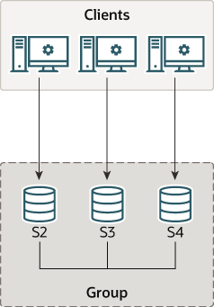

### 18.2.1 单主模式下部署组复制

- [18.2.1.1 部署组复制实例](./18.02.01.01.部署组复制实例.md)
- [18.2.1.2 配置组复制实例](./18.02.01.02.配置组复制实例.md)
- [18.2.1.3 分布式恢复的用户凭证](./18.02.01.03.分布式恢复的用户凭证.md)
- [18.2.1.4 启动组复制](./18.02.01.04.启动组复制.md)
- [18.2.1.5 引导组](./18.02.01.05.引导组.md)
- [18.2.1.6 向组添加实例](./18.02.01.06.向组添加实例.md)

组中的每个MySQL服务器实例都可以在独立的物理主机上运行，这是部署组复制的推荐方式。本节介绍如何创建一个由三个MySQL服务器实例组成的复制组，每个实例都在不同的主机上运行。有关在同一主机上部署多个运行组复制的MySQL服务器实例的信息（例如用于测试目的），请参见第18.2.2节，“本地部署组复制”。

**图18.7 组架构**

本教程解释了如何获取并部署带有组复制插件的MySQL服务器，如何在创建组之前配置每个服务器实例，以及如何使用性能模式监控来验证一切是否正常运行。