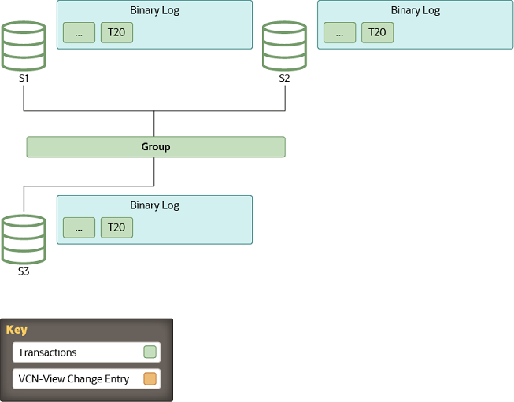

#### 18.5.4.5 分布式恢复的工作原理

当组复制的分布式恢复过程从二进制日志进行状态传输以同步加入成员和捐赠者至特定时间点时，加入成员和捐赠者使用了GTID（参见第17.1.3节，“使用全局事务标识符的复制”）。然而，GTID只提供了一种意识到加入成员缺失哪些事务的方式。它们无法标记出服务器加入组必须追赶的特定时间点，也无法传达认证信息。这是二进制日志视图标记的工作，它在二进制日志流中标记视图变更，并包含额外的元数据信息，为加入成员提供缺失的与认证相关的数据。

本主题解释了视图变更和视图变更标识符的作用，以及从二进制日志进行状态传输的步骤。

##### 视图和视图变更
视图对应于在特定时间点积极参与当前配置的一组成员。他们在组中正常运行并在线。

当组配置发生变化时，例如成员加入或离开，就会发生视图变更。任何组成员身份的变化都会在相同的逻辑时间点向所有成员传达独立的视图变更。

视图标识符唯一地标识了一个视图。每当发生视图变更时，就会生成视图标识符。

在组通信层，视图变更及其相关的视图标识符标记了成员加入前后交换的数据的边界。这个概念通过一个二进制日志事件实现：“视图变更日志事件”（VCLE）。视图标识符被记录下来，以区分在组成员身份发生变化之前和之后传输的事务。

视图标识符本身由两部分组成：一个随机生成的部分和一个单调递增的整数。随机生成的部分在创建组时生成，并在组中至少有一个成员时保持不变。每次发生视图变更时，整数部分就会增加。使用这两个不同的部分使视图标识符能够识别由于成员加入或离开而引起的增量组变化，也能够识别所有成员在完全关闭组时离开组的情况，因此没有任何信息保留下来说明组处于什么视图。当组从头开始时，随机生成标识符的一部分确保二进制日志中的数据标记是唯一的，并且在完全关闭组后不会重复使用相同的标识符，因为这将来会导致分布式恢复出现问题。

##### 开始：稳定组
所有服务器都在线并处理来自组的传入事务。一些服务器在复制的事务方面可能稍微落后，但最终它们会汇合。该组充当一个分布式且已复制的数据库。

图18.8 稳定组

服务器S1、S2和S3是组的成员。他们所有的二进制日志中最新的项目是事务T20。

##### 视图变更：成员加入
每当一个新成员加入组并因此进行视图变更时，每个在线服务器都会为执行而排队一个视图变更日志事件。这是因为在视图变更之前，几个事务可能已在服务器上排队以待应用，这些事务属于旧视图。在它们之后排队视图变更事件可以保证正确标记这发生的时间。

与此同时，加入成员通过视图抽象从在线服务器列表中选择一个合

适的捐赠者，该列表由成员资格服务提供。一个成员在视图4加入，而在线成员将视图变更事件写入二进制日志。

图18.9 成员加入

服务器S4加入组并寻找捐赠者。服务器S1、S2和S3在它们的二进制日志中各自排队了视图变更条目VC4。与此同时，服务器S1正在接收新事务T21。

##### 状态传输：追赶
如果组成员和加入成员都配备了克隆插件（见第18.5.4.2节，“分布式恢复的克隆”），并且加入成员与组之间的事务差异超过了远程克隆操作的阈值（group_replication_clone_threshold），组复制开始使用远程克隆操作进行分布式恢复。如果所需事务不再存在于任何组成员的二进制日志文件中，也会进行远程克隆操作。在远程克隆操作期间，加入成员上的现有数据被移除，并替换为捐赠者的数据副本。当远程克隆操作完成并且加入成员重启后，从捐赠者的二进制日志进行状态传输，以获取在远程克隆操作进行期间组应用的事务。如果事务差距不大，或者未安装克隆插件，组复制直接进入从捐赠者的二进制日志的状态传输。

对于从捐赠者的二进制日志进行状态传输，加入成员和捐赠者之间建立连接，状态传输开始。这种与捐赠者的交互持续到加入组的服务器的应用者线程处理了触发服务器加入组时发生的视图变更对应的视图变更日志事件。换句话说，加入组的服务器从捐赠者那里复制，直到它到达与它已经在的视图标记相匹配的视图标识符的标记。

图18.10 状态传输：追赶

服务器S4选择服务器S2作为捐赠者。从服务器S2到服务器S4执行状态传输，直到到达视图变更条目VC4（view_id = VC4）。服务器S4使用临时应用者缓冲区进行状态传输，其二进制日志目前为空。

由于视图标识符在同一逻辑时间传输给组中的所有成员，加入组的服务器知道它应该停止复制的视图标识符。这避免了复杂的GTID集合计算，因为视图标识符清楚地标记了每个组视图所属的数据。

当加入组的服务器从捐赠者那里复制时，它还在缓存来自组的传入事务。最终，它停止从捐赠者那里复制，并切换到应用那些缓存的事务。

图18.11 排队的事务

状态传输完成。服务器S4已应用了事务到T20，并将其写入其二进制日志。服务器S4在恢复期间将在视图变更后到达的事务T21缓存在临时应用者缓冲区中。

##### 完成：赶上
当加入组的服务器识别到带有预期视图标识符的视图变更日志事件时，它终止与捐赠者的连接，并开始应用缓存的事务。尽管它在二进制日志中充当视图变更的标记，但视图变更日志事件还扮演了另一个角色。它传达了所有服务器在加入组的服务器加入组时的认证信息，换句话说，就是最后一次视图变更。没有它，加入组的服务器将没有必要的信息来认证（检测冲突）后续的事务。

追赶的持续时间不是确定的，因为它取决于工作负载和组中传入事务的速率。这个过程是完全在线的，加入组的服务器在追赶时不会阻塞组中的任何其他服务器。因此，当它进入这个阶段时，加入组的服务器落后的事务数量可以因此而变化，并且根据工作负载的增减而增加或减少。

当加入组的服务器达到零排队事务，并且其存储的数据与其他成员相等时，它的公共状态变为在线。

图18.12 实例在线

在这个阶段，加入组的服务器完全与组同步，处理与组内其他成员相同的事务。这标志着它已完全集成到组中，准备好参与组内的所有活动和交易。通过这种方式，MySQL的组复制保证了高可用性和一致性，确保所有成员始终保持同步，无论新成员何时加入。