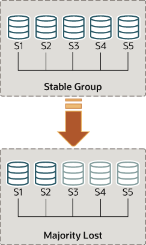

### 18.7.8 处理网络分区和仲裁丢失

当需要复制的变更发生时，组需要达成共识。这适用于常规交易，但也适用于组成员变更和一些保持组一致性的内部消息。共识需要组中大多数成员就给定决策达成一致意见。当丢失大多数组成员时，组无法继续进行，因为无法获得大多数或仲裁。

当有多个非自愿故障发生时，仲裁可能会丢失，导致大多数服务器突然从组中移除。例如，在一个由5个服务器组成的群组中，如果其中3个同时静默，那么大多数会受到影响，因此无法达成仲裁。事实上，剩下的两个无法确定其他3个服务器是否已崩溃，还是网络分区已将这两个孤立，因此无法自动重新配置该组。

另一方面，如果服务器自愿退出组，它们会告知组需要重新配置自己。实际上，这意味着正在离开的服务器会告诉其他成员它即将离开。这意味着其他成员可以正确地重新配置组，维护成员的一致性并重新计算大多数。例如，在上述5台服务器同时离开的情况下，如果这3台服务器逐个告诉组它们即将离开，那么成员能够将自己从5个调整为2个，并在此过程中获得仲裁。

> **注意**
>
> 仲裁丢失本身是规划不足的副作用。为预期的故障数量规划组大小（无论它们是连续发生、同时发生还是零散发生）。

对于处于单一主要模式的组，主要可能有尚未出现在网络分区时的其他成员上的事务。如果考虑从新组中排除主要成员，请注意此类事务可能会丢失。具有额外事务的成员无法重新加入组，尝试会导致错误，错误消息为“此成员执行的事务多于组中的事务”。为组成员设置group_replication_unreachable_majority_timeout系统变量以避免此情况。

以下部分解释了如果系统分区导致无法自动由组中的服务器实现仲裁应该怎么办。

#### 检测分区

replication_group_members性能模式表以从该服务器的角度呈现当前视图中每个服务器的状态。大多数情况下，系统不会遇到分区，因此该表显示在组中的所有服务器之间一致的信息。换句话说，该表上每个服务器的状态在当前视图中都得到了所有成员的认可。但是，如果存在网络分区并且丧失了仲裁，那么该表会显示对于无法联系的那些服务器的状态为UNREACHABLE。这些信息由Group Replication内置的本地故障检测器导出。

图18.14 丧失仲裁



五个服务器实例，S1、S2、S3、S4和S5，部署为一个相互连接的组，这是一个稳定的组。当其中三个服务器S3、S4和S5失败时，大多数丢失，组将无法继续进行。

为了理解这种类型的网络分区，下面的部分描述了最初有5台服务器正常协作，然后一旦只有2台服务器在线发生的变化。图中描述了这种情况。

因此，假设有一个包含以下5台服务器的组：

- 服务器s1，成员标识符199b2df7-4aaf-11e6-bb16-28b2bd168d07
- 服务器s2，成员标识符199bb88e-4aaf-11e6-babe-28b2bd168d07
- 服务器s3，成员标识符1999b9fb-4aaf-11e6-bb54-28b2bd168d07
- 服务器s4，成员标识符19ab72fc-4aaf-11e6-bb51-28b2bd168d07
- 服务器s5，成员标识符19b33846-4aaf-11e6-ba81-28b2bd168d07

最初，该组运行正常，服务器之间正常通信。您可以通过登录s1并查看其replication_group_members性能模式表来验证这一点。例如：

```sql
mysql> SELECT MEMBER_ID,MEMBER_STATE, MEMBER_ROLE FROM performance_schema.replication_group_members;
+--------------------------------------+--------------+-------------+
| MEMBER_ID                            | MEMBER_STATE | MEMBER_ROLE |
+--------------------------------------+--------------+-------------+
| 1999b9fb-4aaf-11e6-bb54-28b2bd168d07 | ONLINE       | SECONDARY   |
| 199b2df7-4aaf-11e6-bb16-28b2bd168d07 | ONLINE       | PRIMARY     |
| 199bb88e-4aaf-11e6-babe-28b2bd168d07 | ONLINE       | SECONDARY   |
| 19ab72fc-4aaf-11e6-bb51-28b2bd168d07 | ONLINE       | SECONDARY   |
| 19b33846-4aaf-11e6-ba81-28b2bd168d07 | ONLINE       | SECONDARY   |
+--------------------------------------+--------------+-------------+
```

然而，几秒钟后发生了灾难性的故障，服务器s3、s4和s5突然停止运行。此后几秒钟，再次查看s1上的replication_group_members表，显示它仍然在线，但其他几个成员不在线。事实上，如下所

示，它们标记为UNREACHABLE。此外，系统无法自动重新配置自身以更改成员身份，因为已丧失了大多数。

```sql
mysql> SELECT MEMBER_ID,MEMBER_STATE FROM performance_schema.replication_group_members;
+--------------------------------------+--------------+
| MEMBER_ID                            | MEMBER_STATE |
+--------------------------------------+--------------+
| 1999b9fb-4aaf-11e6-bb54-28b2bd168d07 | UNREACHABLE  |
| 199b2df7-4aaf-11e6-bb16-28b2bd168d07 | ONLINE       |
| 199bb88e-4aaf-11e6-babe-28b2bd168d07 | ONLINE       |
| 19ab72fc-4aaf-11e6-bb51-28b2bd168d07 | UNREACHABLE  |
| 19b33846-4aaf-11e6-ba81-28b2bd168d07 | UNREACHABLE  |
+--------------------------------------+--------------+
```

该表显示s1现在处于一个没有外部干预就无法继续的组中，因为大多数服务器都无法联系。在这种情况下，需要重置组成员列表以允许系统继续进行，这在本节中有所解释。或者，您还可以选择停止s1和s2上的Group Replication（或完全停止s1和s2），查明s3、s4和s5发生了什么，然后重新启动Group Replication（或服务器）。

#### 解除分区

Group Replication使您能够通过强制特定配置来重置组成员列表。例如，在上面的情况下，s1和s2是唯一在线的服务器，您可以选择强制使用仅包含s1和s2的成员配置。这需要检查有关s1和s2的一些信息，然后使用`group_replication_force_members`变量。

图18.15 强制新成员


组中的三台服务器，S3、S4和S5，已失败，因此大多数已丢失，组无法继续进行。通过下文中描述的干预，S1和S2可以自行组成一个稳定的组。

假设您回到了只有s1和s2是组中唯一剩下的服务器的情况。服务器s3、s4和s5已意外离开了组。为使s1和s2继续运行，您希望强制执行仅包含s1和s2的成员配置。

> **警告**
>
> 此过程使用`group_replication_force_members`，应被视为最后的紧急措施。必须极其小心使用它，仅用于覆盖仲裁丢失。如果被滥用，可能会创建人为的脑裂情况或完全阻止整个系统。

在强制执行新成员配置时，请确保将要强制退出组的任何服务器确实已停止。在上面描述的情况下，如果s3、s4和s5并非真正不可访问，而是在线的，它们可能已经形成了自己的功能分区（它们是5个中的3个，因此它们具有多数）。在这种情况下，强制使用s1和s2的组成员列表可能会创建人为的脑裂情况。因此，在强制执行新成员配置之前，很重要的一点是确保要排除的服务器确实已关闭，并且如果它们没有关闭，请在继续之前将它们关闭。

> **警告**
>
> 对于处于单一主要模式的组，主要可能有尚未出现在网络分区时的其他成员上的事务。如果考虑从新组中排除主要成员，请注意此类事务可能会丢失。具有额外事务的成员无法重新加入组，尝试会导致错误，错误消息为“此成员执行的事务多于组中的事务”。为组成员设置group_replication_unreachable_majority_timeout系统变量以避免此情况。

回顾一下，系统被阻塞，当前的配置如下（由s1上的本地故障检测器感知）：

```sql
mysql> SELECT MEMBER_ID,MEMBER_STATE FROM performance_schema.replication_group_members;
+--------------------------------------+--------------+
| MEMBER_ID                            | MEMBER_STATE |
+--------------------------------------+--------------+
| 1999b9fb-4aaf-11e6-bb54-28b2bd168d07 | UNREACHABLE  |
| 199b2df7-4aaf-11e6-bb16-28b2bd168d07 | ONLINE       |
| 199bb88e-4aaf-11e6-babe-28b2bd168d07 | ONLINE       |
| 19ab72fc-4aaf-11e6-bb51-28b2bd168d07 | UNREACHABLE  |
| 19b33846-4aaf-11e6-ba81-28b2bd168d07 | UNREACHABLE  |
+--------------------------------------+--------------+
```

要做的第一件事是检查s1和s2的本地地址（组通信标识符）是什么。登录到s1和s2，然后获取该信息如下。

```sql
mysql> SELECT @@group_replication_local_address;
```

一旦知道了s1（127.0.0.1:10000）和s2（127.0.0.1:10001）的组通信地址，您可以在其中一个服务器上使用它来注入新的成员配置，从而覆盖已丢失仲裁的现有配置。在s1上执行以下操作：

```sql
mysql> SET GLOBAL group_replication_force_members="127.0.0.1:10000,127.0.0.1:10001";
```

这将通过强制不同的配置来解锁组。在此更改后，检查s1和s2上的`replication_group_members`以验证更改后的组成员身份。首先在s1上检查：

```sql
mysql> SELECT MEMBER_ID,MEMBER_STATE FROM performance_schema.replication_group_members;
+--------------------------------------+--------------+
| MEMBER_ID                            | MEMBER_STATE |
+--------------------------------------+--------------+
| b5ffe505-4ab6-11e6-b04b-28b2bd168d07 | ONLINE       |
| b60907e7-4ab6-11e6-afb7-28b2bd168d07 | ONLINE       |
+--------------------------------------+--------------+
```

然后在s2上检查：

```sql
mysql> SELECT * FROM performance_schema.replication_group_members;
+--------------------------------------+--------------+
| MEMBER_ID                            | MEMBER_STATE |
+--------------------------------------+--------------+
| b5ffe505-4ab6-11e6-b04b-28b2bd168d07 | ONLINE       |
| b60907e7-4ab6-11e6-afb7-28b2bd168d07 | ONLINE       |
+--------------------------------------+--------------+
```

成功使用`group_replication_force_members`系统变量强制新的组成员配置并解锁组后，请确保清除该系统变量。`group_replication_force_members`必须为空，才能发出`START GROUP_REPLICATION`语句。