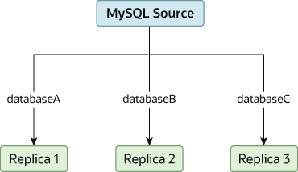

### 19.4.6 将不同的数据库复制到不同的副本

在某些情况下，您可能有一个单一的源服务器，并希望将不同的数据库复制到不同的副本。例如，您可能想将不同的销售数据分发给不同的部门，以帮助在数据分析期间分散负载。此布局的示例如图 19.2 “将数据库复制到不同的副本”所示。

**图 19.2 将数据库复制到不同的副本**

MySQL 源拥有三个数据库：databaseA、databaseB 和 databaseC。databaseA 仅复制到 MySQL 副本 1，databaseB 仅复制到 MySQL 副本 2，databaseC 仅复制到 MySQL 副本 3。

您可以通过正常配置源和副本，然后使用每个副本上的 `--replicate-wild-do-table` 配置选项来限制每个副本处理的二进制日志语句来实现这种分离。

> **重要提示**
>
> 在使用基于语句的复制时，您不应使用 `--replicate-do-db` 来达到此目的，因为基于语句的复制会导致此选项的效果根据当前选定的数据库而变化。这也适用于混合格式的复制，因为这会启用一些更新使用基于语句的格式进行复制。

然而，如果您仅使用基于行的复制，使用 `--replicate-do-db` 来达到此目的应该是安全的，因为在这种情况下，当前选定的数据库对选项的操作没有影响。

例如，为了支持如图 19.2 “将数据库复制到不同的副本”所示的分离，您应该在执行 `START REPLICA` 前按如下配置每个副本：

- 副本 1 应使用 `--replicate-wild-do-table=databaseA.%`。
- 副本 2 应使用 `--replicate-wild-do-table=databaseB.%`。
- 副本 3 应使用 `--replicate-wild-do-table=databaseC.%`。

在此配置中，每个副本接收来自源的整个二进制日志，但只执行那些适用于该副本上有效的 `--replicate-wild-do-table` 选项所包括的数据库和表的事件。

如果在复制开始之前，您有数据必须同步到副本，您有几个选择：

- 将所有数据同步到每个副本，然后删除您不想保留的数据库、表或两者。
- 使用 `mysqldump` 为每个数据库创建一个单独的转储文件，并在每个副本上加载适当的转储文件。
- 使用原始数据文件转储，并仅包括每个副本所需的特定文件和数据库。

> **注意**
>
> 除非您使用 `innodb_file_per_table`，否则这不适用于 InnoDB 数据库。