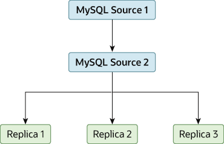

### 19.4.7 改善复制性能

随着连接到一个源的副本数量增加，尽管负载很小，但也会增加，因为每个副本都使用一个客户端连接到源。此外，由于每个副本都必须接收源的完整二进制日志副本，源的网络负载也可能增加并创建瓶颈。

如果您使用大量副本连接到一个源，并且该源也在忙于处理请求（例如，作为扩展解决方案的一部分），那么您可能希望提高复制过程的性能。

提高复制过程性能的一种方法是创建一个更深层次的复制结构，使源仅复制到一个副本，其余副本连接到这个主副本以满足它们各自的复制需求。此结构的示例显示在图 19.3 “使用额外的复制源来提升性能”中。

**图 19.3 使用额外的复制源来提升性能**

服务器 MySQL 源 1 复制到服务器 MySQL 源 2，后者又复制到服务器 MySQL 副本 1、MySQL 副本 2 和 MySQL 副本 3。

为使其工作，您必须按如下配置 MySQL 实例：

- 源 1 是主源，所有更改和更新都写入数据库。两个源服务器都启用了二进制日志记录，这是默认设置。
- 源 2 是服务器源 1 的副本，为复制结构中其余的副本提供复制功能。源 2 是唯一允许连接到源 1 的机器。源 2 启用了 `--log-slave-updates` 选项（这是默认设置）。使用此选项，来自源 1 的复制指令也会写入源 2 的二进制日志，然后可以复制到真正的副本。
- 副本 1、副本 2 和副本 3 作为源 2 的副本，复制源 2 的信息，实际上包括记录在源 1 上的更新。

上述解决方案减少了主源上的客户端负载和网络接口负载，应该提高用作直接数据库解决方案时主源的整体性能。

如果您的副本在跟上源的复制过程方面遇到困难，有几个可用的选项：

- 如果可能，将中继日志和数据文件放在不同的物理驱动器上。为此，设置 `relay_log` 系统变量以指定中继日志的位置。
- 如果二进制日志文件和中继日志文件的磁盘 I/O 活动对读取操作造成影响，考虑增加 `rpl_read_size` 系统变量的值。此系统变量控制从日志文件读取的最小数据量，增加它可能减少文件读取和 I/O 停顿，当文件数据当前未被操作系统缓存时。请注意，为从二进制日志和中继日志文件读取的每个线程（包括源上的转储线程和副本上的协调器线程）分配一个此值大小的缓冲区。因此，设置较大的值可能会影响服务器的内存消耗。
- 如果副本的速度明显慢于源，您可能希望将复制不同数据库的责任分配给不同的副本。参见第 19.4.6 节，“将不同的数据库复制到不同的副本”。
- 如果您的源使用事务，而您不关心副本上的事务支持，可以在副本上使用 MyISAM 或其他非事务引擎。参见第 19.4.4 节，“使用不同源和副本存储引擎的复制”。

- 如果您的副本不作为源使用，并且您已经有了确保在发生故障时能启动源的潜在解决方案，则可以在副本上禁用系统变量 `log_replica_updates`（从 MySQL 8.0.26 开始）或 `log_slave_updates`（在 MySQL 8.0.26 之前）。这可以防止“哑”副本也将它们执行的事件记录到自己的二进制日志中。