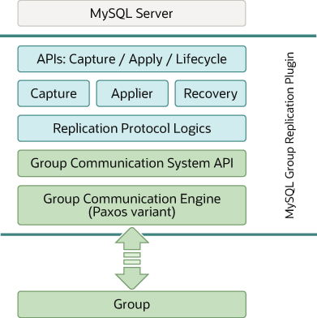

### 20.1.5 群组复制插件架构

MySQL群组复制是一个MySQL插件，它基于现有的MySQL复制基础架构构建，利用了如二进制日志、基于行的日志记录和全局事务标识符等特性。它与当前的MySQL框架集成，如性能模式或插件和服务基础设施。下图展示了一个块图，描述了MySQL群组复制的整体架构。

**图 18.6 群组复制插件块图**

MySQL群组复制插件包括一组用于捕获、应用和生命周期的API，这些API控制插件与MySQL服务器的交互方式。有接口使信息从服务器流向插件，反之亦然。这些接口将MySQL服务器核心与群组复制插件隔离开来，大多是放置在事务执行管道中的钩子。从服务器到插件的一个方向上，有诸如服务器启动、服务器恢复、服务器准备好接受连接以及服务器即将提交事务等事件的通知。在另一个方向上，插件指示服务器执行诸如提交或中止正在进行的事务，或将事务排队到中继日志中的操作。

群组复制插件架构的下一层是一组组件，当通知路由到它们时会做出反应。捕获组件负责跟踪正在执行的事务相关的上下文。应用组件负责在数据库上执行远程事务。恢复组件管理分布式恢复，负责通过选择捐赠者、管理追赶程序和对捐赠者失败做出反应，使加入群组的服务器保持最新状态。

继续往下，复制协议模块包含复制协议的特定逻辑。它处理冲突检测，并接收并将事务传播到群组。

群组复制插件架构的最后两层是群组通信系统（GCS）API和一个基于Paxos的群组通信引擎（XCom）的实现。GCS API是一个高级API，它抽象出构建复制状态机所需的属性（参见第18.1节，“群组复制背景”）。因此，它将消息层的实现与插件的其余上层解耦。群组通信引擎处理与复制群组成员的通信。