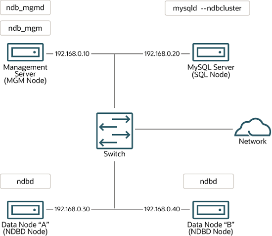

## 25.3 NDB Cluster 安装

- [25.3.1 在 Linux 上安装 NDB Cluster](./25.03.01.在 Linux 上安装 NDB Cluster/25.03.01.00.在 Linux 上安装 NDB Cluster.md)
- [25.3.2 在 Windows 上安装 NDB Cluster](./25.03.02.在 Windows 上安装 NDB Cluster/25.03.02.00.在 Windows 上安装 NDB Cluster.md)
- [25.3.3 NDB Cluster 的初始配置](./25.03.03.NDB Cluster 的初始配置.md)
- [25.3.4 NDB Cluster 的初次启动](./25.03.04.NDB Cluster 的初次启动.md)
- [25.3.5 带有表和数据的 NDB Cluster 示例](./25.03.05.带有表和数据的 NDB Cluster 示例.md)
- [25.3.6 NDB Cluster 的安全关闭和重启](./25.03.06.NDB Cluster 的安全关闭和重启.md)
- [25.3.7 NDB Cluster 的升级和降级](./25.03.07.NDB Cluster 的升级和降级.md)
- [25.3.8 NDB Cluster 自动安装程序（不再支持）](./25.03.08.NDB Cluster 自动安装程序（不再支持）.md)

本节描述了规划、安装、配置和运行 NDB Cluster 的基础知识。虽然[第 25.4 节，NDB Cluster 的配置](../ndb-cluster-configuration.html)中的示例提供了有关各种集群选项和配置的更深入信息，但遵循此处的指南和步骤应能得到一个符合最低可用性和数据安全要求的可用 NDB Cluster。

有关不同版本之间升级或降级 NDB Cluster 的信息，请参见[第 25.3.7 节，NDB Cluster 的升级和降级](../ndb-cluster-upgrading-downgrading.html)。

本节涵盖硬件和软件要求、网络问题、NDB Cluster 的安装、基本配置问题、启动、停止和重启集群、加载示例数据库和执行查询。

**假设**。以下各节对集群的物理和网络配置做了一些假设。这些假设将在接下来的几段中讨论。

**集群节点和主机**。集群由四个节点组成，每个节点在一台单独的主机上，每个节点在典型的以太网网络上有一个固定的网络地址，如下所示：

| 节点                | IP 地址       |
| ------------------- | ------------- |
| 管理节点 (mgmd)     | 198.51.100.10 |
| SQL 节点 (mysqld)   | 198.51.100.20 |
| 数据节点 "A" (ndbd) | 198.51.100.30 |
| 数据节点 "B" (ndbd) | 198.51.100.40 |

此设置如下图所示：

**图 25.4 NDB Cluster 多计算机设置**



**网络地址**。为了简化（并提高可靠性），本教程仅使用数字 IP 地址。然而，如果您的网络上有 DNS 解析功能，可以在配置集群时使用主机名代替 IP 地址。或者，您可以使用 hosts 文件（通常在 Linux 和其他类 Unix 操作系统中为 `/etc/hosts`，在 Windows 上为 `C:\WINDOWS\system32\drivers\etc\hosts`，或相应的操作系统文件）提供主机查找功能。

从 NDB 8.0.22 开始，NDB 支持所有 NDB Cluster 节点之间连接的 IPv6 地址。

在运行 NDB 8.0.22 及更高版本的 Linux 平台上存在一个已知问题，即操作系统内核需要提供 IPv6 支持，即使没有使用任何 IPv6 地址。在 NDB 8.0.34 及更高版本中，此问题已解决（Bug #33324817, Bug #33870642）。

如果您使用受影响的版本并希望在系统上禁用 IPv6 支持（因为您不打算为 NDB Cluster 节点使用任何 IPv6 地址），请在启动系统后执行以下操作：

```sh
$> sysctl -w net.ipv6.conf.all.disable_ipv6=1
$> sysctl -w net.ipv6.conf.default.disable_ipv6=1
```

（或者，您可以将相应的行添加到 `/etc/sysctl.conf`。）在 NDB Cluster 8.0.34 及更高版本中，不需要上述步骤，您可以简单地在 Linux 内核中禁用 IPv6 支持，如果您不需要它。

在 NDB 8.0.21 及更早版本中，用于连接数据节点和管理节点的所有网络地址必须使用 IPv4 或可以解析为 IPv4 地址，包括 SQL 节点用于联系其他节点的地址。

**hosts 文件的潜在问题**。尝试为集群节点使用主机名时常见的问题之一是由于某些操作系统（包括一些 Linux 发行版）在安装过程中设置系统主机名的方式导致的。考虑两个主机名为 `ndb1` 和 `ndb2` 的机器，它们都在集群网络域中。Red Hat Linux（包括一些衍生版本如 CentOS 和 Fedora）将以下条目放在这些机器的 `/etc/hosts` 文件中：

```ini
# ndb1 /etc/hosts:
127.0.0.1   ndb1.cluster ndb1 localhost.localdomain localhost
```

```ini
# ndb2 /etc/hosts:
127.0.0.1   ndb2.cluster ndb2 localhost.localdomain localhost
```

SUSE Linux（包括 OpenSUSE）将这些条目放在机器的 `/etc/hosts` 文件中：

```ini
# ndb1 /etc/hosts:

127.0.0.1       localhost
127.0.0.2       ndb1.cluster ndb1
```

```ini
# ndb2 /etc/hosts:

127.0.0.1       localhost
127.0.0.2       ndb2.cluster ndb2
```

在这两种情况下，`ndb1` 将 `ndb1.cluster` 路由到回环 IP 地址，但从 DNS 获取 `ndb2.cluster` 的公共 IP 地址，而 `ndb2` 将 `ndb2.cluster` 路由到回环地址，并获得 `ndb1.cluster` 的公共地址。结果是每个数据节点连接到管理服务器，但无法知道是否有其他数据节点已连接，因此数据节点在启动时似乎挂起。

> **注意**
>
> 在 `config.ini` 中不能混合使用 `localhost` 和其他主机名或 IP 地址。出于这些原因，此类情况下的解决方案（除了为所有 `config.ini` 中的 `HostName` 条目使用 IP 地址外）是从 `/etc/hosts` 中删除完全限定的主机名，并在 `config.ini` 中使用这些主机名作为所有集群主机的条目。

**主机类型**。在我们的安装场景中，每台主机都是一台基于 Intel 的台式机，运行标准配置的支持操作系统，并且没有运行不必要的服务。具有标准 TCP/IP 网络功能的核心操作系统应足够简单。为了简化，我们还假设所有主机上的文件系统设置相同。如果它们不相同，则应相应地调整这些说明。

**网络硬件**。每台机器上安装了标准的 100 Mbps 或 1 Gbps 以太网卡及其驱动程序，并且所有四台主机通过标准以太网网络设备（如交换机）连接。（所有机器应使用相同吞吐量的网卡，即集群中的四台机器应全部使用 100 Mbps 网卡或全部使用 1 Gbps 网卡。）NDB Cluster 可以在 100 Mbps 网络中工作；然而，千兆以太网提供更好的性能。

> **重要**
>
> NDB Cluster 不适用于吞吐量低于 100 Mbps 或延迟高的网络。因此，尝试在广域网（如互联网）上运行 NDB Cluster 可能不会成功，并且在生产中不支持。

**示例数据**。我们使用 world 数据库，可从 MySQL 网站下载（参见 [MySQL 文档](https://dev.mysql.com/doc/index-other.html)）。我们假设每台机器都有足够的内存来运行操作系统、所需的 NDB Cluster 进程，并在数据节点上存储数据库。

有关安装 MySQL 的一般信息，请参见第 2 章，[安装 MySQL](../../installation.html)。有关在 Linux 和其他类 Unix 操作系统上安装 NDB Cluster 的信息，请参见[第 25.3.1 节，在 Linux 上安装 NDB Cluster](../ndb-cluster-install-linux.html)。有关在 Windows 操作系统上安装 NDB Cluster 的信息，请参见[第 25.3.2 节，在 Windows 上安装 NDB Cluster](../ndb-cluster-install-windows.html)。

有关 NDB Cluster 硬件、软件和网络要求的一般信息，请参见[第 25.2.3 节，NDB Cluster 硬件、软件和网络要求](../ndb-cluster-hardware-software-requirements.html)。